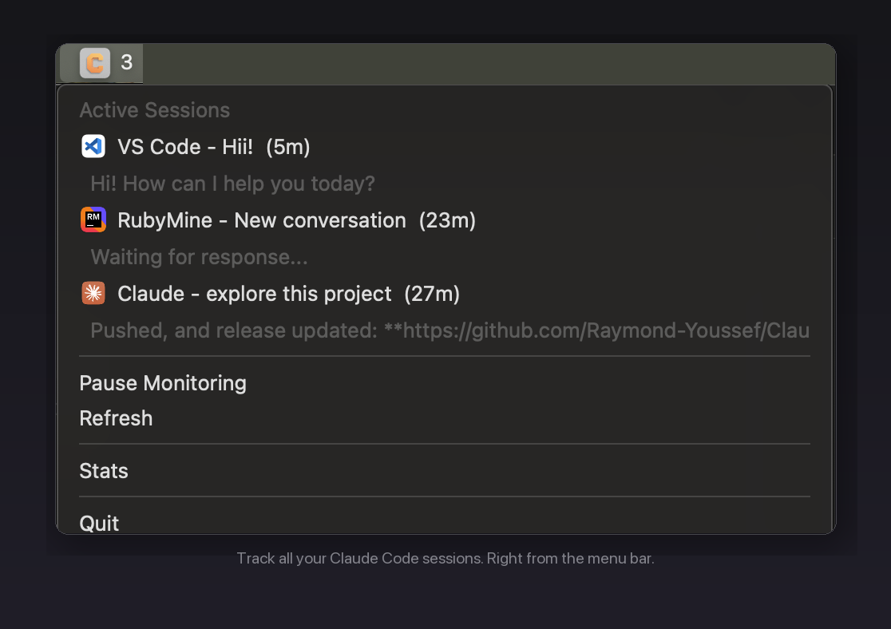

# ClaudeWatch

A lightweight macOS menu bar app that tracks all your [Claude Code](https://docs.anthropic.com/en/docs/claude-code) sessions across different IDEs and terminals.

<p align="center">
  
</p>

## Features

- **System-wide tracking** -- Monitors all `claude` processes regardless of where they're launched
- **Desktop notifications** -- Get notified when sessions start, complete, or need your input
- **Live dashboard** -- Click the menu bar icon to see all active sessions with their latest responses
- **Click to focus** -- Click any session to jump to the correct IDE window and tab
- **IDE detection** -- Automatically identifies which IDE or terminal launched each session
- **Runtime tracking** -- See how long each session has been running
- **Session statistics** -- Track completed sessions and average duration

## Supported IDEs and Terminals

VS Code, Cursor, RubyMine, PyCharm, IntelliJ IDEA, WebStorm, GoLand, iTerm2, Terminal.app, Warp, Alacritty, Kitty, Claude Desktop

## Installation

### Option A: Pre-built App (Recommended)

Download the latest `ClaudeWatch.app` from [Releases](https://github.com/Raymond-Youssef/ClaudeWatch/releases), move it to `/Applications`, and open it.

### Option B: Build from Source

```bash
git clone https://github.com/Raymond-Youssef/ClaudeWatch.git
cd ClaudeWatch
pip3 install -r requirements.txt
python3 setup.py py2app
open dist/ClaudeWatch.app
```

### Option C: Run Directly

```bash
git clone https://github.com/Raymond-Youssef/ClaudeWatch.git
cd ClaudeWatch
pip3 install -r requirements.txt
python3 -m claudewatch
```

### Auto-start on Login

Run `./install.sh` to set up a LaunchAgent that starts ClaudeWatch automatically when you log in.

## Usage

Once running, a robot icon appears in your menu bar with a count of active sessions.

**Menu bar** -- Click to see all active sessions. Each entry shows the IDE, conversation title, runtime, and latest response.

**Click a session** -- Focuses the IDE window (and exact tab) where that session is running.

**Notifications** -- You'll be notified when:
- A new session is detected
- A session is waiting for your input or tool approval
- A session completes

Clicking a notification focuses the relevant IDE window.

**Stats** -- View active count, sessions completed today, and average duration.

## How It Works

ClaudeWatch scans for running `claude` processes every 5 seconds using `psutil`. For each session it:

1. **Detects the parent IDE** by walking the process tree
2. **Finds the JSONL conversation file** in `~/.claude/projects/` by matching process creation time against `~/.claude/history.jsonl`
3. **Watches the JSONL file** (via `watchdog`) for state changes -- new messages, tool use requests, completion
4. **Monitors process exit** (via `kqueue`) for instant completion detection
5. **Sends macOS notifications** (via `UNUserNotificationCenter`) when the session needs attention

All session data is stored locally in `~/.claudewatch/sessions.json`.

## Development

### Prerequisites

- macOS 10.14+
- Python 3.7+

### Setup

```bash
git clone https://github.com/Raymond-Youssef/ClaudeWatch.git
cd ClaudeWatch
pip3 install -r requirements.txt
pip3 install pytest
```

### Running Tests

```bash
pytest tests/ -v
```

The test suite has 397 tests covering all modules.

### Building the App

```bash
python3 setup.py py2app
# Output: dist/ClaudeWatch.app
```

### Project Structure

```
claudewatch/
  app.py            # Menu bar UI (thin rumps shell)
  controller.py     # Business logic and session lifecycle
  session.py        # Session state and JSON persistence
  monitor.py        # Process discovery via psutil
  jsonl.py          # Claude JSONL file parsing
  watcher.py        # File system monitoring via watchdog
  pidwatcher.py     # Process exit detection via kqueue
  focus.py          # IDE window focusing via AppleScript
  notifications.py  # macOS notification center integration
tests/
  test_*.py         # 397 tests across 10 modules
```

## Data Storage

All data is stored locally in `~/.claudewatch/sessions.json`. No data is sent anywhere.

## Uninstallation

```bash
./uninstall.sh
```

Or manually:
```bash
# Stop the app
pkill -f ClaudeWatch

# Remove auto-start
launchctl unload ~/Library/LaunchAgents/com.claudewatch.plist
rm ~/Library/LaunchAgents/com.claudewatch.plist

# Remove data
rm -rf ~/.claudewatch
```

## License

[MIT](LICENSE)
